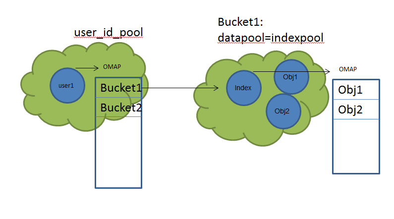

title: RGW
author: qing
date: 2018-04-08
description: Ceph RWG
tags:
category:
acl: 00

# Ceph RGW 代码分析

## daemon 启动

通过dup2将STDERR重定向到STDOUT，分析命令行参数，获取配置文件列表，解析配置文件，根据配置文件内容设置`cct->_conf`数据结构, `cct`是`CephContext`的一个对象。选择API的Frontend。 接着调用`global/global_init.cc::global_init`，该函数会设置中断任务和完成用户切换，使用命令行中指定的用户运行程序。接着创建运行时目录，默认是`/var/run/ceph`。调用所有全局配置的观察者，通知他们配置发生了变化。这里的配置变化应该是由命令行参数的解析和配置文件的解析引起的。从代码注释看对全局配置的订阅应该是最近引入的，在`common/config.h::md_confg_t`中实现。设置运行目录，日志的所有者为当前程序的所有者和组。调用`rgw_tools_init`通过外部文件初始化MIME映射（文件后缀->MIME Type)。初始化DNS解析器。初始化Rados。启动性能计数。初始化REST，初始化rgw属性到http属性的映射，比如`content_language`->`Content-Language`。初始化http属性到rgw属性。TODO：为什么要加HTTP_?根据`rgw_extended_http_attrs`初始化HTTP扩展属性。初始化HTTP CODE到Text map(`http_status_names`)，比如`404`->`Not Found`。将zone group中的所有主机名称放入`hostnames_set`中。将zone group中的所有主机的S3名称放入`hostnames_s3website_set`中。初始化rgw用户(TODO: rgw chained cache和store的关系)。初始化rgw bucket(RGWMetadataManager)。根据设置决定要启用哪些API(比如，S3，Swift，swift_auth, admin)。将设置完的rest做为参数启动frontend framework。

## RGW Rest

## RGW REST

`class RGWREST`是REST的入口函数，其他使用rest功能的代码一般都在这里开始，比如注册REST Manager或者获取处理handler。

### RGW Framework

由于现在RGW支持几种不同的Framework，在代码中定义了`class RGWFrontend`类抽象了不同Framework的操作。

    :::c++
    class RGWFrontend {
      ...
      virtual int init() = 0;
    
      virtual int run() = 0;
      virtual void stop() = 0;
      virtual void join() = 0;
    
      virtual void pause_for_new_config() = 0;
      virtual void unpause_with_new_config(RGWRados *store) = 0;
    };

J版中RGW默认使用`RGWMongooseFrontend`，这个类继承自`RGWFrontend`。下面是对这个类的分析。

#### RGWMongooseFrontend

在`rgw_civetweb_frontend.cc::RGWMongooseFrontend::run`中设置civeweb的启动参数，包括端口，keep alive,线程数等。设置回调函数,包括`begin_request`, `log_message`, `log_access`。`begin_request`最终会调用`rgw_process.cc::process_request`，`process_request`通过`rest->get_handler`获取资源的handler, `get_handler`其实就是URL分发的过程，具体步骤如下节。资源handler使用正确的op来最终处理这个请求。在Handler中op_XXX 开头的函数对应HTTP method，而`get_op`则是通过HTTP method获得对应的op对象, 这个函数在`rgw_rest.cc`中实现。

### URL分发

RGWRESTMgr这个类主要负责资源的注册，url分发。如下代码是`rgw_main.cc::main`的节选，其中`RGWRESTMgr_Admin`, `RGWRESTMgr_Usage`, `RGWRESTMgr_User`...是`RGWRESTMgr`的子类,从`register_resource`可以看到他们的层级关系`RGWRESTMgr_Usage`, `RGWRESTMgr_User`...位于`RGWRESTMgr_Admin`的下层。

    :::c++
    RGWRESTMgr_Admin *admin_resource = new RGWRESTMgr_Admin;
    admin_resource->register_resource("usage", new RGWRESTMgr_Usage);
    admin_resource->register_resource("user", new RGWRESTMgr_User);
    admin_resource->register_resource("bucket", new RGWRESTMgr_Bucket);

URL分发是资源注册的反向过程，通过URL找到对应的handler。如下是获取handler的过程，通过URL找到对应的`RGWRESTMgr`，再根据manager来获得handler。

    :::c++
    RGWHandler_REST* RGWREST::get_handler(RGWRados *store, struct req_state *s,
    				      RGWStreamIO *sio, RGWRESTMgr **pmgr,
    				      int *init_error)
    {
      ...
    
      RGWRESTMgr *m = mgr.get_resource_mgr(s, s->decoded_uri, &s->relative_uri);
      if (!m) {
        *init_error = -ERR_METHOD_NOT_ALLOWED;
        return NULL;
      }
 
      ...   

      handler = m->get_handler(s);
      if (!handler) {
        *init_error = -ERR_METHOD_NOT_ALLOWED;
        return NULL;
      }

      ...

    } /* get stream handler */

获取RGWRESTMgr的过程比较简单，就是使用`/`拆分URL然后逐级查找对应的resource。

    :::c++
    RGWRESTMgr *RGWRESTMgr::get_resource_mgr(struct req_state *s, const string& uri, string *out_uri)
    {
      *out_uri = uri;
    
      multimap<size_t, string>::reverse_iterator iter;
    
      for (iter = resources_by_size.rbegin(); iter != resources_by_size.rend(); ++iter) {
        string& resource = iter->second;
        if (uri.compare(0, iter->first, resource) == 0 &&
    	(uri.size() == iter->first ||
    	 uri[iter->first] == '/')) {
          string suffix = uri.substr(iter->first);
          return resource_mgrs[resource]->get_resource_mgr(s, suffix, out_uri);
        }
      }
    
      if (default_mgr)
        return default_mgr;
    
      return this;
    }

REST基本操作GET/PUT/POST/DELETE...在RGWHandler_REST中定义，这个类主要做为基类给其他类使用。

## S3接口实现

### list bucket操作

List主要调用过程`rgw_process.cc::process_request`->`rgw_rest.cc::RGWREST::get_handler`->`rgw_rest.cc::RGWHandler_REST::get_op`->`rgw_rest_s3.cc::RGWHandler_REST_Service_S3::op_get`->`rgw_process.cc::rgw_process_authenticated`->`op->execute()`->`rgw_op.cc::RGWListBuckets::execute`，这里主要分析下这个函数的内容。
用户所有的buckets存储在`user_id.to_str()+RGW_BUCKETS_OBJ_SUFFIX`对象所在的omap中，其中`RGW_BUCKETS_OBJ_SUFFIX=".buckets"`。

    :::c++
    void rgw_get_buckets_obj(const rgw_user& user_id, string& buckets_obj_id)
    {
      buckets_obj_id = user_id.to_str();
      buckets_obj_id += RGW_BUCKETS_OBJ_SUFFIX;
    }

而这个Object位于在`user_uid_pool`中。定位到Bucket对应的对象后，rgw会发送一个`class=user, method=list_buckets`的操作。对应的Deamon收到这个操作后根据注册内容查找到的函数为`cls_user.cc::cls_user_list_buckets`，这个函数再调用`class_api.cc::cls_cxx_map_get_vals`获取多个omap的value,最终得到那个用户所有的Bucket。各个pool还有Bucket的关系如下所示。

### create bucket操作
Create的调用过程跟list类似，真正的操作在`RGWCreateBucket::execute`中执行。
在domain_root pool中创建一个以bucket name命名的object。Bucket的对象名字由tenant和bucketname两部分组成, 如果tenant为空，那么bucketname就是全局唯一的，多个用户不能创建相同名字的Bucket。如果创建Bucket时带有locationConstraint那么当前region需要满足这个限制，否则无法创建。Bucket的Placement rule需要在zone group的placement targets中，否则不满足rule就不能创建。如果用户试图创建一个已经存在的Bucket，而且这个Bucket的拥有者和这次的创建者冲突，那么创建失败。excute会调用`store->create_bucket`。
`rgw_rados.cc::RGWRados::create_bucket`过程主要完成下面的工作。获得Index pool的context，初始化Index。初始化Index的主要内容就是创建Index对象，对象的命名规则如下。Base Index对象已`.dir.`开头，后跟`bucket_id`，如果没有启动index shard的话唯一的Index对象名就是base index对象名。如果有shard，就在后面添加点和数字，比如第一个shard的index就是`.dir.bucket_id.1`。Bucket的信息会放在domain_root，已`.bucket.meta.`+Bucketname命名的对象中。

### create object操作

# RGW Bucket
RGW的一个Bucket对应到Rados上的三个pool(`data_pool`,`data_extra_pool`,`index_pool`)，这三个pool可以指向同一个pool。

## RGW Store

### RGWStoreManager

`RGWStoreManager::get_storage`返回一个`RGWRados`对象或者`RGWCache<RGWRados>`。`get_storage`最终会调用`RGWRados::init_rados`。这个函数会初始化一组`librados::Rados`对象,并且连接到rados集群。这些`Rados`对象会在被获取时会被放入一个`thread_id->Rados`的map中，这样单个线程在使用这些对象时不会发生争抢。接着会初始`RGWRados::meta_mgr`和`RGWRados::data_log`属性。

`class RGWRados`用于跟Rados集群交互。比如一组`open_*_ctx`函数用于打开对应pool的上下文。

## Rados library
`librados.hpp::librados::ObjectWriteOperation`将多个写操作操作聚合到这个对象中，这个类是`librados.hpp::librados::ObjectOperation`的子类。`librados::ObjectOperation`包含一个`ObjectOperationImpl`的对象，这个对象中有一个全局的`::ObjectOperation`对象，用于下发对OSD的操作。
`Objecter.h::ObjectOperation::call`生成一个新的对osd的远程调用，把调用信息包括class的名字，method，和给method的参数。这个函数只是将远程调用信息放入list中，并不是立即调用。需要`op_submit`将操作提交给osd。

## ToDO

* Thread
* GC
* zone/zone group
* What Is Bucket Index?

It’s a different kind of metadata, and kept separately. The bucket index holds a key-value map in rados objects. By default it is a single rados object per bucket, but it is possible since Hammer to shard that map over multiple rados objects. The map itself is kept in omap, associated with each rados object. The key of each omap is the name of the objects, and the value holds some basic metadata of that object – metadata that shows up when listing the bucket. Also, each omap holds a header, and we keep some bucket accounting metadata in that header (number of objects, total size, etc.).
* Object operation transaction
